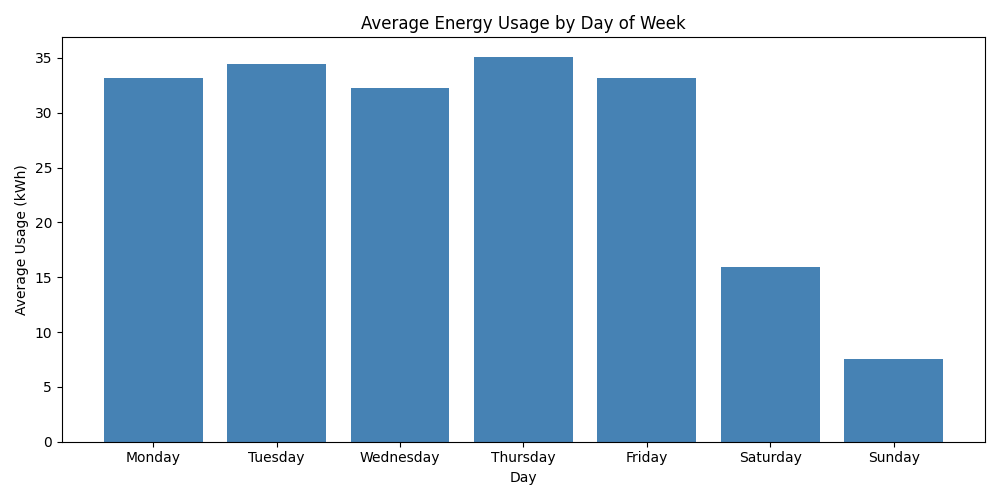
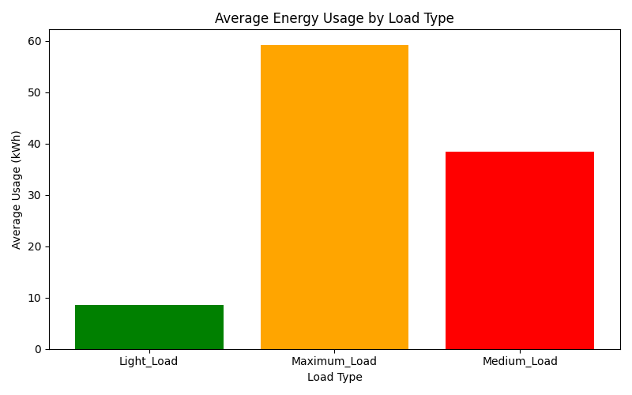
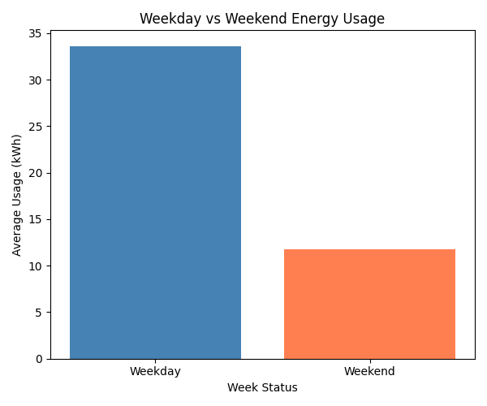
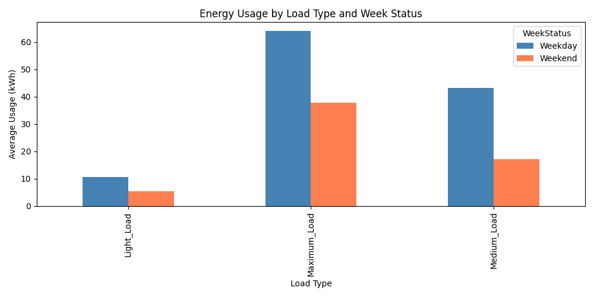

# 🏭 Tata Steel Energy Consumption Analysis

## 📌 Overview
This project analyzes energy consumption patterns in the steel industry using real-world data. The goal is to identify usage trends, peak consumption periods, and CO2 emission patterns to support better energy management decisions.

## 📊 Dataset
- **Source:** UCI Machine Learning Repository
- **Dataset:** Steel Industry Energy Consumption
- **Records:** 35,040 entries
- **Features:** Usage_kWh, CO2 emissions, Load Type, Week Status, Day of Week

## 🛠️ Tools Used
- Python
- Pandas
- Matplotlib
- Excel

## 🔍 Key Insights
1. **Thursday** has the highest average energy consumption
2. **Sunday** has the lowest energy consumption — weekends show significantly lower usage
3. **Maximum Load** type consumes the most energy on average
4. Strong positive correlation between energy usage and CO2 emissions
5. Weekdays consume more energy than weekends consistently

## 📈 Charts
### Average Energy Usage by Day of Week


### Energy Usage by Load Type


### Weekday vs Weekend Energy Usage


### CO2 Emissions vs Energy Usage


### Energy Usage by Load Type and Week Status


## 💡 Recommendations
1. Schedule high-energy tasks on **Sundays** when base load is lowest
2. Monitor and optimize **Maximum Load** periods to reduce peak consumption
3. Implement energy-saving protocols on **Thursdays** — highest usage day
4. Target CO2 reduction by focusing on high usage periods

## 🚀 How to Run
```bash
pip install pandas matplotlib
python analysis.py
```

## 👤 Author
SAHIL BISWAS — Data Analyst Intern, Tata Steel.